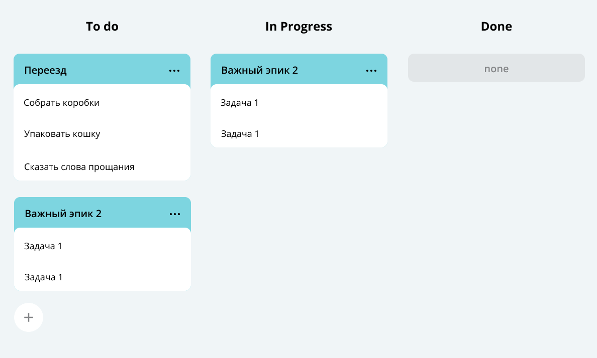

Это репозиторий учебного проекта "Трекер Задач"
---
 *Данный проект реализует бэкенд-часть концепции канбан-доски*

# Задачи имеют 3 типа:
* Простая задача (Task)
* Большая задача (Epic), в которую входят подзадачи
* Подзадача (Subtask) как часть эпика

# Приложение поддерживает следующие функции:
1. Стандартные CRUD для задач каждого типа
2. Получение истории просмотров 10 последних задач
3. Вывод задач в порядке приоритета
---
# Функциональность реализуется с помощью интерфейса TaskManager, который имеет 3 имплементации:
1. InMemory (задачи хранятся в памяти)
2. FileBacked (логика хранения задач в файле формата .csv)
3. Http (доступ к методам по Http, хранение задач в Key-Value базе данных)
---
# Tests
* Код покрыт тестами на каждый endpoint и метод менеджера

# Примененные библиотеки
* JUnit5
* Gson
---
